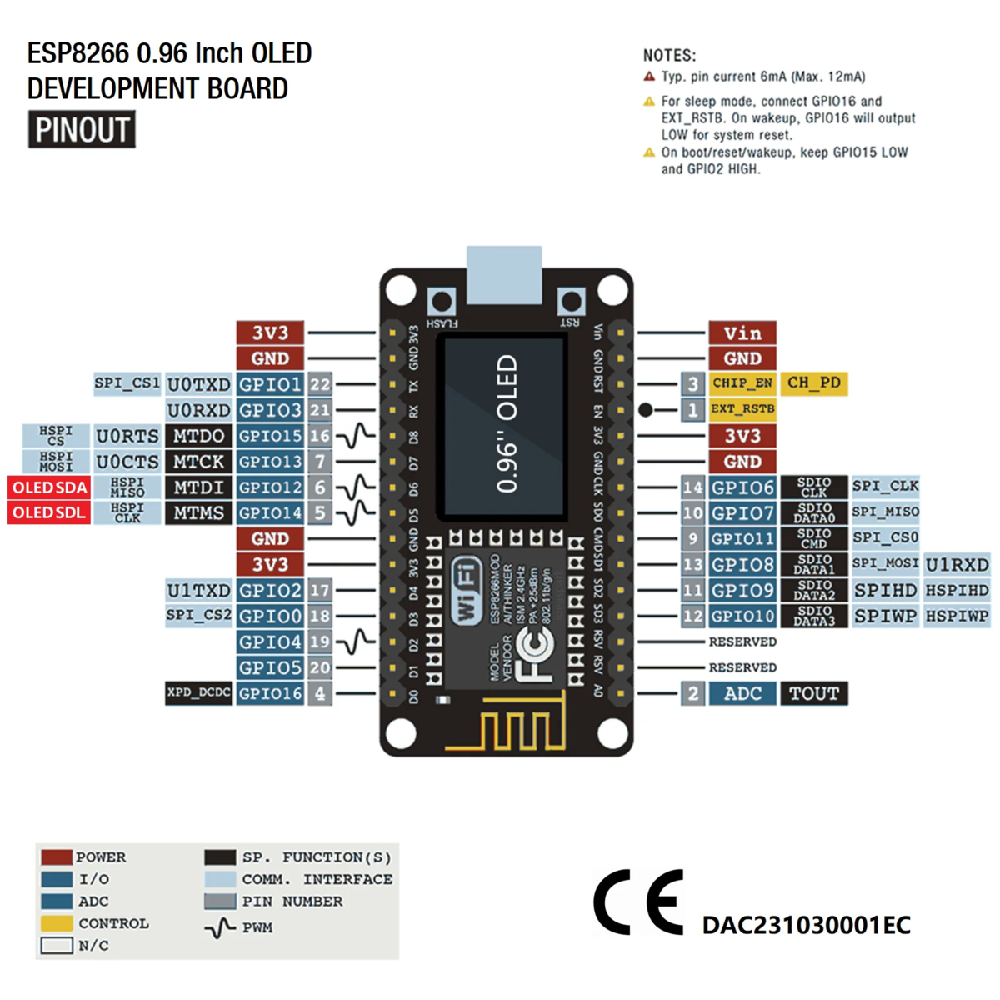

:PROPERTIES:
:ID:       fadfd560-08e9-4974-b00b-d3fb934a9b0f
:END:
#+TITLE: esp8266 (OLED) and RFID-RC522
#+TYPE: post
#+DATE: 2026-02-18
#+TAGS: electronics

* Board Wiring
:PROPERTIES:
:ID:       152958a7-8d74-412e-8b5b-c8b01984cf83
:END:

Use following wiring if you have ESP8266 with 0.96 OLED screen from IdeaSpark. 
I got mine for cheap on AliExpress[fn:1].

| RC522 | ESP8266 |
|-------|---------|
| SCK   | D5      |
| MISO  | D6      |
| MOSI  | D7      |
| SDA   | D2      |
| RST   | D1      |
| 3V3   | 3V      |
| GND   | G       |

This is the board i got:

#+DOWNLOADED: screenshot @ 2026-02-18 17:09:14

* Code defines
:PROPERTIES:
:ID:       a7caf7b7-2dd3-46e2-9309-587ba1c6db54
:END:

It's a bit different than wireing standard 8266, because it has OLED screen, which takes pins D5 and D6 for itself,
and there's no other alternatives but to reuse them and disable OLED.
This scheme and bunch of other useful info could be found at manualplus[fn:2].

#+BEGIN_SRC cpp
#define RST_PIN D1
#define SS_PIN D2
#+END_SRC

* Simple code to test reading

#+begin_src cpp
#include <SPI.h>
#include <MFRC522.h>

#define RST_PIN D1
#define SS_PIN D2

MFRC522 mfrc522(SS_PIN, RST_PIN);

void setup() {
  Serial.begin(9600);
  delay(3000);
  SPI.begin();
  mfrc522.PCD_Init();
  Serial.println(mfrc522.PCD_PerformSelfTest() ? "RC522 OK" : "RC522 FAIL");
  Serial.println("Scan a card...");
}

void loop() {
  if (!mfrc522.PICC_IsNewCardPresent()) return;
  if (!mfrc522.PICC_ReadCardSerial()) return;
  Serial.print("UID: ");
  for (byte i = 0; i < mfrc522.uid.size; i++) {
    Serial.print(mfrc522.uid.uidByte[i], HEX);
    Serial.print(" ");
  }
  Serial.println();
}
#+end_src

[fn:1] IdeaSpark esp8266 with 0.96 OLED Screen - https://www.aliexpress.com/item/1005005242283189.html 
[fn:2] Manual for 8266 - https://manuals.plus/ae/1005005242283189
